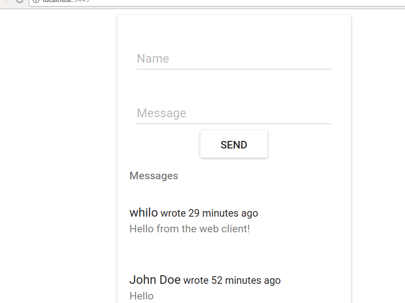

# chat42  

We have
a
[demo deployed on IPFS](https://ipfs.io/ipfs/Qmc2fKMZf6o3N7bafPKMkXvhcfBaoVS5uTRXTBUGpeVzFr/).
It uses a websocket connection to our test server on topiq.es. This is a simple
web-chat application which leverages [replikativ](http://replikativ.io) for its
state management.

chat42 consists of two parts, a client written
with [ClojureScript](https://clojurescript.org/)
and [om-next](https://github.com/omcljs/om/wiki/Quick-Start-(om.next)) (react)
that compiles into efficient Javascript, and a server written in Clojure that
brokers communication between peers over a websocket. The server will be
available for node.js soon and is only necessary to ensure a communication
channel.

There is also a [react native client](https://github.com/replikativ/chat42app).

It was initially created as
a
[presentation for ClojureScript](https://github.com/replikativ/chat42/blob/master/presentation.org) in
our local JavaScript meetup.

## Usage

You need to have [Leiningen](https://leiningen.org/) installed.

### Client development

Just run figwheel and edit `core.cljs` as needed. If the replikativ parts are un clear, also have a look at the [API walkthrough](http://replikativ.io/tut/get-started.html).

~~~clojure
lein figwheel
~~~

This allows you to develop the client against our test server.

### Server peer

If you want to persist and distribute your own state, run the server with:

~~~clojure
lein run
~~~

The server will automatically connect to our new test net and dump potentially a
few gigabytes to your disk. If you don't want this, comment out:

~~~clojure
(connect! stage "ws://replikativ.io")
~~~

to 

~~~clojure
#_(connect! stage "ws://replikativ.io")
~~~

in [core.clj](https://github.com/replikativ/chat42/blob/master/src/clj/chat42/core.clj#L14)

You also have to change the uri in `core.cljs` to make the client connect to
your server and not the test server.

If you have any problems, questions or suggestions, please
join our gitter chat.

## License

Copyright © 2016-2017 Konrad Kühne, Christian Weilbach

Distributed under the Eclipse Public License either version 1.0 or (at
your option) any later version.
